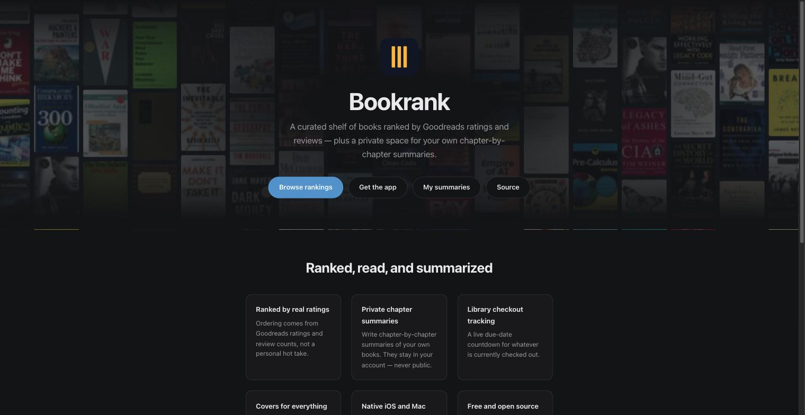
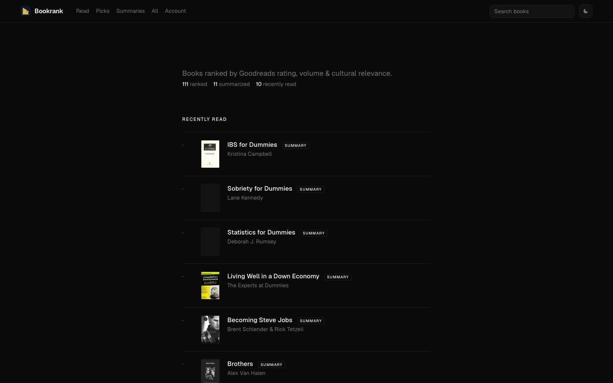
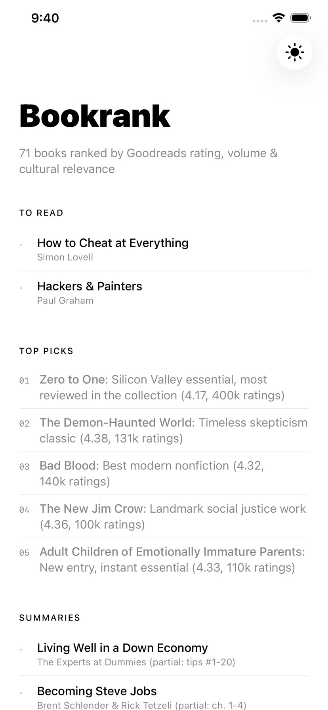
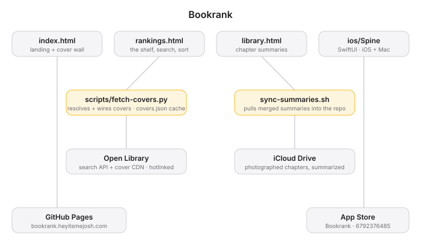

# Bookrank

 [](https://github.com/nulljosh/bookrank) [](https://apps.apple.com/us/app/bookrank/id6792376485) [](https://apps.apple.com/us/app/bookrank/id6792376485?mt=12)

A curated collection of book rankings based on Goodreads ratings and reviews.
Live at [bookrank.heyitsmejosh.com](https://bookrank.heyitsmejosh.com).



## Pages

- `index.html` — landing page. The hero is a slow-drifting wall built at runtime from every cover in `scripts/covers.json`, so it stays in sync as books are added.
- `rankings.html` — the shelf itself: recently read, to-read, top picks, summaries, and the full ranked list. Sticky header with live search (`/` to focus), star ratings, and a sort control. Counts are computed from the markup rather than hardcoded.
- `library.html` — private chapter-by-chapter summaries.
- `book_rankings.md` — markdown version of the rankings.



## Covers

`scripts/fetch-covers.py` resolves a cover for every book against Open Library and wires it into `rankings.html`. Images are hotlinked from Open Library's CDN — nothing is stored here. Lookups are cached in `scripts/covers.json` (keyed by Goodreads slug, falling back to title+author for books with no Goodreads link), so re-runs cost no requests.

```
python3 scripts/fetch-covers.py                 # look up missing covers, patch rankings.html
python3 scripts/fetch-covers.py --dry-run       # list books with no cover yet
python3 scripts/fetch-covers.py --retry-misses  # re-query books cached as "no cover"
```

Books with no cover on either source get a placeholder slot, so every row stays aligned. A null in `covers.json` means both APIs answered and neither had a cover; lookups that fail outright are reported and left uncached, so the next run retries them.

## iOS App

`ios/Bookrank` is a native SwiftUI app with a shared `BookrankMac` target, generated from `ios/project.yml` via xcodegen. The bundle identifier is still `com.heyitsmejosh.spine` — it predates the rename and is bound to the App Store Connect record, so it stays.



## Project Map



## Roadmap

See `roadmap.md` in this repo root.

## Whitepaper

[Technical whitepaper](WHITEPAPER.md)

## API and agent tools

Bookrank has no HTTP API — `library.html` talks to Supabase directly. It registers WebMCP tools for agents; see [docs/API.md](docs/API.md).
