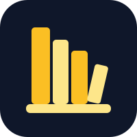
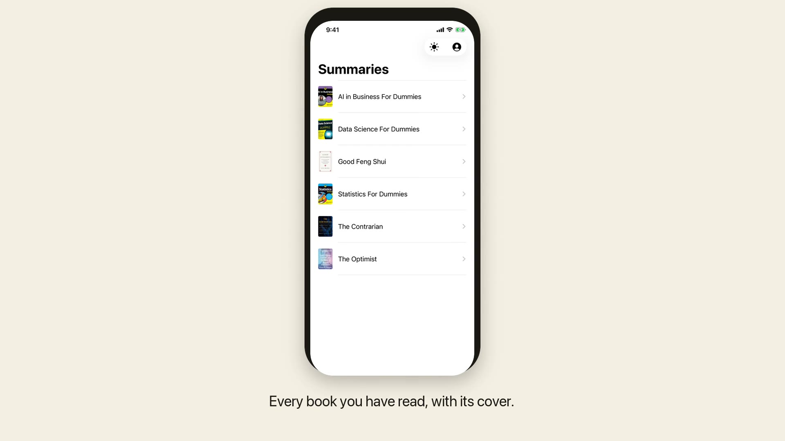

# Bookrank

 [](https://github.com/nulljosh/bookrank) [](https://apps.apple.com/us/app/bookrank/id6792376485) [](https://apps.apple.com/us/app/bookrank/id6792376485?mt=12)

You finish a book. A month later you remember one idea. Bookrank keeps the rest: every chapter in plain words, read it or listen to it.

[](https://github.com/nulljosh/bookrank/releases/download/v1.0.2/bookrank-ad.mp4)

Free on the [web](https://bookrank.heyitsmejosh.com), iPhone, iPad and Mac.

- **Chapters.** A list of your books. Open one, pick a chapter, read it.
- **Listen.** Two voices talk the chapter through. The word being read lights up and the page follows.
- **Private.** Your summaries sit behind your account. Share one with a link if you want.
- **Goodreads.** Paste your profile and the books you have read but not summarized show up.
- **Offline.** The app keeps your books and covers on the device.

## Run it

```
node --test              # the tests
sh scripts/build-site.sh # builds dist/
```

Deploys with `wrangler pages deploy dist`. The iOS and Mac apps are generated from `ios/project.yml` with xcodegen; the bundle ID stays `com.heyitsmejosh.spine`.

[Project map](architecture.svg) · [Architecture](docs/ARCHITECTURE.md) · [Roadmap](roadmap.md) · [Whitepaper](WHITEPAPER.md) · [Agent tools](docs/API.md)
